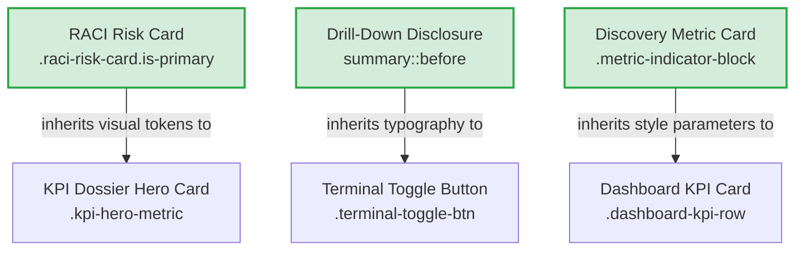
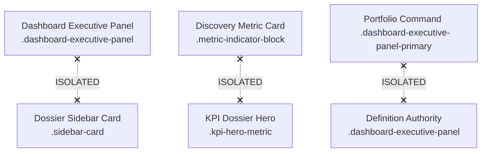
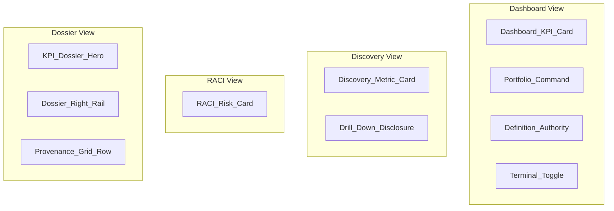

# LEAP UI Architecture Manifest

This document serves as the authoritative constitution and structural blueprint for the LEAP visual design system. It details the page architecture, component ownership, design token hierarchy, visual boundaries, modifications rules, recovery protocols, and operational guidelines for future engineers and AI agents.

---

## 1. Page Architecture

The LEAP application consists of five structural page layout systems:

* **Index Dashboard (`index.html`)**: The core landing interface. It handles aggregate portfolio summaries, high-level metrics, needs-attention list items, and the execution terminal console.
* **Discovery Workspace (`discovery_report.html`)**: Tabbed analytics interface presenting portfolio confidence classification, validation metrics, decision lists, and lineage tables.
* **RACI Directory (`raci_directory.html`)**: Grid-based role mapping view detailing stakeholder assignments, risk metrics, and metric accountability directories.
* **KPI Dossiers (Individual KPI Pages)**: Individual documentation files (e.g. `yield_percentage.html`) containing hero stats, mathematical formulas, lineage grids, and right-rail metadata panels.
* **Search Interface (`search.html`)**: Dedicated interface for keyword and property searching, filtering, and portfolio query indexing.

---

## 2. Canonical Component Ownership

| Component Name | Canonical Page | Component Owner | Downstream Consumers | Forbidden Consumers |
| :--- | :--- | :--- | :--- | :--- |
| **Dashboard KPI Card** | `index.html` | Dashboard Header | Discovery Metric Cards | Dashboard Executive Panels |
| **Portfolio Command** | `index.html` | Primary Panel | None | Discovery grids, right-rail sidebars |
| **Definition Authority** | `index.html` | Secondary Panel | None | Primary highlight cards, metric cards |
| **Discovery Metric Card** | `discovery_report.html` | Discovery Page | Dashboard KPI Cards | Dossier Hero Cards |
| **RACI Risk Card** | `raci_directory.html` | RACI Page | KPI Dossier Hero Cards | Base Metric Cards, Sidebars |
| **KPI Dossier Hero** | `yield_percentage.html` | Dossier Page Header | None | Base Metric Cards, sidebars |
| **KPI Right Rail Card** | `yield_percentage.html` | Sidebar Inspector | None | Dashboard Executive Panels |
| **Provenance Grid Row** | `yield_percentage.html` | Evidence Tabs | None | Lineage formula panels |
| **Disclosure Control** | `discovery_report.html` | Drill-Down Summary | Terminal Toggle Button | Toggle perspective selectors |

---

## 3. Visual Token Hierarchy

* **Typography**:
  * Body text: Inter/system-sans (`font-size: 14px`, `line-height: 1.5`).
  * Monospace / Math / Code: JetBrains Mono (`font-size: 13px`, `line-height: 1.45`).
  * Big Metric Values: `font-size: 40px` (Dashboard and Discovery stats).
  * Panel Header Labels: `font-size: 10px-11px` (uppercase, letter-spacing `0.05em` to `0.1em`).
* **Color System**:
  * `--surface`: Primary light card background (#FFFFFF).
  * `--surface-soft`: Primary light grey background (#F8FAFC).
  * `--charcoal`: Dark text and card color (#1E293B).
  * `--business-teal`: Primary action/interactive highlight accent (#0F766E).
  * Premium gradient mix: `linear-gradient(135deg, charcoal + surface + surface-soft)` used in executive highlight panels.
* **Spacing**:
  * General layout gap: `24px` to `34px`.
  * Grid card spacing: `12px` to `18px`.
  * Inline gaps: `8px`.
* **Radius**:
  * Base cards: `8px`.
  * Sidebar inspectors: `10px`.
  * Executive panels & RACI risk blocks: `12px` to `14px`.
* **Elevation & Shadows**:
  * Primary Dashboard Panel: `0 18px 46px rgba(15, 23, 42, 0.07)`.
  * Secondary Dashboard Panel: `0 10px 28px rgba(15, 23, 42, 0.045)`.
  * Base Cards: None (rely on `1px` border colors).
* **Disclosure Controls**:
  * Marker content: `+` / `−`.
  * Line weight: Monospace bold, `13px` width allocation.
* **Motion & Transitions**:
  * CSS transitions: `.control-plane-terminal` expand transitions (`max-height 0.25s ease`, `min-height 0.25s ease`).

---

## 4. Component Inheritance Map



---

## 5. Explicit Visual Isolation Boundaries

To prevent visual regressions, the design system enforces three hard boundary layouts:



---

## 6. CSS Modification Protocol

* **Allowed Changes**:
  * Editing parameters within container-scoped classes (e.g. `.kpi-dossier-workspace .sidebar-card`).
  * Adjusting padding, margins, and layouts inside local media query blocks.
  * Adjusting colors using standard CSS tokens.
* **Restricted Changes**:
  * Modifying shared class selectors like `.leap-metric-card` or `.sidebar-card` without adding a layout prefix class.
  * Changing layout values of `.evidence-lineage-panel` which might displace tab panel spacing.
* **Forbidden Changes**:
  * Changing core variable color declarations (`--surface`, `--charcoal`) at the root level.
  * Removing block/flex rules on `.micro-label` that break text/spacing properties.
  * Adding styles to `body`, `html`, or global headings that degrade visual rendering across the workspace.

---

## 7. Visual Regression Recovery Protocol

If a commit degrades the visual system, developers and AI agents must follow this recovery sequence:

1. **Abort Modifications**: Immediately stop manual styling edits.
2. **Git Rollback**: Execute `git checkout docs/_static/custom.css templates/index.html` to return to the baseline tag:
   ```bash
   git checkout tags/ui-baseline-2026-07-06
   ```
3. **Hard Rebuild**: Recompile the project to verify it matches the fallback:
   ```bash
   python run_generation.py sample_project
   ```
4. **Targeted Redesign**: Re-apply only specific layout adjustments, prefixing each new style with its parent page grid class.

---

## 8. AI Agent Operating Rules

AI agents and automated builders are strictly prohibited from violating the following boundaries:

* **PROHIBITED**: Writing global selector overrides for `.leap-metric-card` or `.sidebar-card`.
* **PROHIBITED**: Unifying layouts of RACI cards and KPI hero cards under a single shared selector.
* **PROHIBITED**: Re-enabling hover-based expansions on the execution terminal.
* **PROHIBITED**: Altering the document titles, primary navigation headers, or sidebar menus.
* **PROHIBITED**: Declaring widths on inline tags (e.g. `span`) without blockifying them.

---

## 9. LEAP Visual Philosophy

The LEAP design system is built upon six foundational principles:

* **Enterprise**: Tailored for enterprise metadata hierarchies, emphasizing clean tables, structured RACI models, and clear documentation.
* **Governed**: Clear visual status cues (Validated/Pending review) indicate data authority and trustworthiness.
* **Premium**: High-contrast, clean dark accents (`#1E293B`) paired with smooth border gradients that avoid generic flat designs.
* **Calm**: A color palette restricted to slate greys, soft blues, and subtle teals to limit distraction.
* **Explainable**: Visual logic (lineage charts, formula trees, provenance lines) is laid out cleanly to make metadata roots easily audit-ready.
* **Operational**: Status panels and execution cockpits provide real-time operational feedback.

---

## 10. System Ownership & Boundaries


