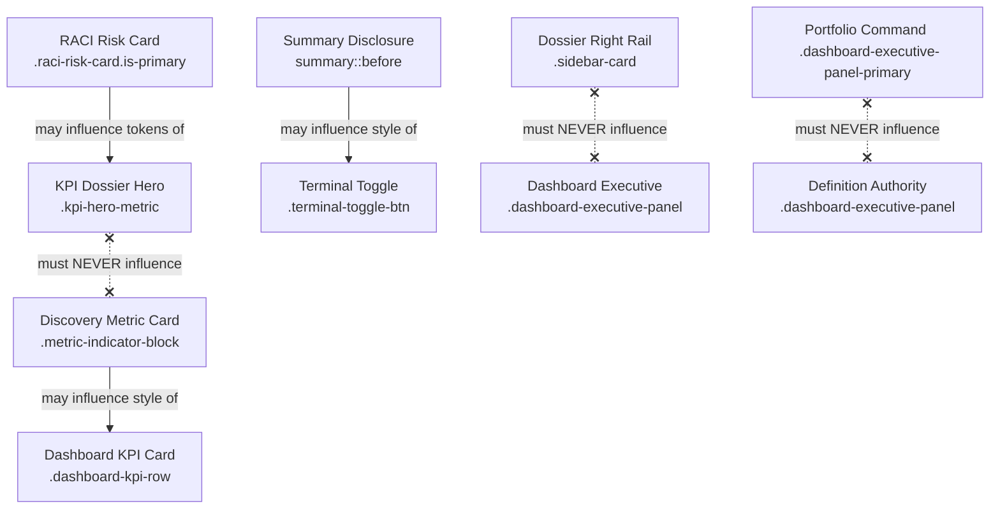

# LEAP UI Governance & Modification Policy

This document defines the strict governance rules, modification boundaries, and safety policies for modifying components within the LEAP UI design system.

---

## Component Governance Catalog

### 1. Dashboard KPI Cards
* **Canonical Selector**: `.blueprint-header-stats .leap-metric-card`
* **Visual Owner**: Index Dashboard (`index.html`)
* **Structural Owner**: Blueprint Header Layout (`custom.css`)
* **Pages Using It**: `index.html` (Index Dashboard)
* **Golden Reference Page**: `index.html` (Top Row Stats)
* **Regression Test Pages**: `index.html`, `test_app.py`
* **Allowed Inheritance**: Discovery metric cards
* **Forbidden Inheritance**: Dashboard executive panels
* **Allowed Visual Copying**: None
* **Allowed Token Sharing**: Color palette, border radius
* **Reuse / Extend / Wrap / Visual Clone**:
  * Reused: Yes (as stats components)
  * Extended: No (keep configuration fixed)
  * Wrapped: No
  * Visually Cloned: No
* **Risk Level**: **LOW**
* **Approval Required?**: No (for local layout spacing changes)
* **Breaking Change Example**: Changing `.leap-metric-card` display from block/flex to grid without explicit container overrides, shifting numbers into horizontal alignment.

### 2. Portfolio Command Card
* **Canonical Selector**: `.dashboard-executive-panel-primary`
* **Visual Owner**: Executive Dashboard
* **Structural Owner**: Primary Dashboard Grid Layout
* **Pages Using It**: `index.html`
* **Golden Reference Page**: `index.html` (Portfolio Command panel)
* **Regression Test Pages**: `index.html`
* **Allowed Inheritance**: None (completely standalone highlight visual)
* **Forbidden Inheritance**: Standard metric cards, right rail cards
* **Allowed Visual Copying**: None
* **Allowed Token Sharing**: `--charcoal`, `--business-teal` tokens
* **Reuse / Extend / Wrap / Visual Clone**:
  * Reused: No (singleton card)
  * Extended: No
  * Wrapped: No
  * Visually Cloned: No
* **Risk Level**: **HIGH**
* **Approval Required?**: **YES** (requires design lead review)
* **Breaking Change Example**: Overriding the background to solid charcoal or changing font size clamp properties, displacing the coverage pill grid below.

### 3. Definition Authority Panel
* **Canonical Selector**: `.dashboard-executive-panel`
* **Visual Owner**: Executive Dashboard
* **Structural Owner**: Secondary Dashboard Grid Layout
* **Pages Using It**: `index.html`
* **Golden Reference Page**: `index.html` (Definition Authority panel)
* **Regression Test Pages**: `index.html`
* **Allowed Inheritance**: None
* **Forbidden Inheritance**: Primary command cards, metric cards
* **Allowed Visual Copying**: None
* **Allowed Token Sharing**: `--surface-soft`, radius token
* **Reuse / Extend / Wrap / Visual Clone**:
  * Reused: No (singleton card)
  * Extended: No
  * Wrapped: No
  * Visually Cloned: No
* **Risk Level**: **MEDIUM**
* **Approval Required?**: No
* **Breaking Change Example**: Adding borders to `.dashboard-executive-panel` that override secondary flat card designs.

### 4. Discovery Intelligence Band
* **Canonical Selector**: `.discovery-intelligence-band`
* **Visual Owner**: Discovery Workspace
* **Structural Owner**: Intelligence Section Grid Layout
* **Pages Using It**: `discovery_report.html`
* **Golden Reference Page**: `discovery_report.html` (Readiness summary section)
* **Regression Test Pages**: `discovery_report.html`
* **Allowed Inheritance**: None
* **Forbidden Inheritance**: Right-rail modules
* **Allowed Visual Copying**: None
* **Allowed Token Sharing**: `var(--surface-soft)` background, layout gaps
* **Reuse / Extend / Wrap / Visual Clone**:
  * Reused: Yes (as section headers)
  * Extended: No
  * Wrapped: No
  * Visually Cloned: No
* **Risk Level**: **MEDIUM**
* **Approval Required?**: No
* **Breaking Change Example**: Modifying the margin or padding globally on `.discovery-intelligence-band`, shifting stats layouts on other workspace tabs.

### 5. Discovery Metric Cards
* **Canonical Selector**: `.metric-indicator-block`
* **Visual Owner**: Discovery Workspace
* **Structural Owner**: General Stats Layout
* **Pages Using It**: `discovery_report.html`, `index.html`
* **Golden Reference Page**: `discovery_report.html` (Portfolio Intelligence cells)
* **Regression Test Pages**: `discovery_report.html`
* **Allowed Inheritance**: Dashboard KPI cards
* **Forbidden Inheritance**: Dossier hero cards
* **Allowed Visual Copying**: Dashboard KPI cards
* **Allowed Token Sharing**: Color-mix definitions, font scales
* **Reuse / Extend / Wrap / Visual Clone**:
  * Reused: Yes
  * Extended: Yes (with specific helper classes)
  * Wrapped: Yes
  * Visually Cloned: Yes (via helper classes)
* **Risk Level**: **LOW**
* **Approval Required?**: No
* **Breaking Change Example**: Overriding the padding or card border radius inside `.metric-indicator-block` directly, modifying top row stats layout.

### 6. RACI Risk Cards
* **Canonical Selector**: `.raci-risk-card.is-primary`
* **Visual Owner**: RACI Directory
* **Structural Owner**: RACI Card Grid
* **Pages Using It**: `raci_directory.html`
* **Golden Reference Page**: `raci_directory.html` ("Top Accountable Owner")
* **Regression Test Pages**: `raci_directory.html`
* **Allowed Inheritance**: None
* **Forbidden Inheritance**: Base metric cards
* **Allowed Visual Copying**: KPI dossier hero cards
* **Allowed Token Sharing**: Background color mix and radii
* **Reuse / Extend / Wrap / Visual Clone**:
  * Reused: Yes (as directory cards)
  * Extended: No
  * Wrapped: No
  * Visually Cloned: Yes (as dossier hero modules)
* **Risk Level**: **HIGH**
* **Approval Required?**: **YES**
* **Breaking Change Example**: Changing `.raci-risk-card` base layout to inline-block or floating properties, collapsing RACI columns.

### 7. KPI Dossier Hero Cards
* **Canonical Selector**: `.kpi-dossier-workspace .kpi-hero-metrics .kpi-hero-metric`
* **Visual Owner**: Dossier Header
* **Structural Owner**: Dossier Grid Layout
* **Pages Using It**: KPI Dossiers (`yield_percentage.html`, etc.)
* **Golden Reference Page**: `yield_percentage.html` (Top Header row)
* **Regression Test Pages**: All generated dossier pages
* **Allowed Inheritance**: Copies visual tokens from RACI risk cards
* **Forbidden Inheritance**: Base metric cards, right rail layouts
* **Allowed Visual Copying**: RACI risk cards
* **Allowed Token Sharing**: Dark charcoal palette mix
* **Reuse / Extend / Wrap / Visual Clone**:
  * Reused: Yes (across dossier templates)
  * Extended: No
  * Wrapped: No
  * Visually Cloned: No
* **Risk Level**: **CRITICAL**
* **Approval Required?**: **YES** (requires architectural sign-off)
* **Breaking Change Example**: Removing the fixed `height: 72px` and letting it expand to `min-height: 128px`, displacing the entire primary documentation header area.

### 8. KPI Dossier Right Rail Cards
* **Canonical Selector**: `.kpi-dossier-workspace .kpi-dossier-right .sidebar-card`
* **Visual Owner**: Dossier Inspector
* **Structural Owner**: Right Rail Sidebar
* **Pages Using It**: KPI Dossiers
* **Golden Reference Page**: `yield_percentage.html` (Right sidebar cards)
* **Regression Test Pages**: All generated dossiers
* **Allowed Inheritance**: None
* **Forbidden Inheritance**: Dashboard executive panels
* **Allowed Visual Copying**: None
* **Allowed Token Sharing**: `var(--surface)` background, radius variables
* **Reuse / Extend / Wrap / Visual Clone**:
  * Reused: Yes
  * Extended: Yes
  * Wrapped: Yes
  * Visually Cloned: No
* **Risk Level**: **HIGH**
* **Approval Required?**: No
* **Breaking Change Example**: Adding high-contrast background colors or changing border declarations, breaking dossier visual hierarchy.

### 9. Provenance Rows
* **Canonical Selector**: `.evidence-tab-panel[data-evidence-panel="provenance"] .evidence-detail-grid > div`
* **Visual Owner**: Dossier Evidence Panel
* **Structural Owner**: Tab Content Panels
* **Pages Using It**: KPI Dossiers (Lineage Evidence)
* **Golden Reference Page**: `yield_percentage.html` (Provenance tab)
* **Regression Test Pages**: All generated dossiers
* **Allowed Inheritance**: None
* **Forbidden Inheritance**: Inputs and formula templates
* **Allowed Visual Copying**: None
* **Allowed Token Sharing**: Font sizes
* **Reuse / Extend / Wrap / Visual Clone**:
  * Reused: No (local grid override)
  * Extended: No
  * Wrapped: No
  * Visually Cloned: No
* **Risk Level**: **MEDIUM**
* **Approval Required?**: No
* **Breaking Change Example**: Restructuring the labels inside `.evidence-detail-grid` to be blocks instead of spans, collapsing spacing.

### 10. Disclosure Controls
* **Canonical Selector**: `.evidence-lineage-panel > summary::before` / `.terminal-toggle-btn`
* **Pages Using It**: All pages, Cockpit Terminal Console
* **Purpose**: Expandable details toggles (`+` / `−`)
* **Visual Owner**: Shared Utilities
* **Structural Owner**: Details/Summary Layouts
* **Pages Using It**: All pages
* **Golden Reference Page**: `discovery_report.html` (Portfolio Drill-Down summary)
* **Regression Test Pages**: `discovery_report.html`, `index.html`
* **Allowed Inheritance**: Terminal toggle button inherits typography of drill-down summary
* **Forbidden Inheritance**: None
* **Allowed Visual Copying**: None
* **Allowed Token Sharing**: Monospace font family, `--business-teal` color
* **Reuse / Extend / Wrap / Visual Clone**:
  * Reused: Yes
  * Extended: No
  * Wrapped: Yes
  * Visually Cloned: Yes (on terminal buttons)
* **Risk Level**: **LOW**
* **Approval Required?**: No
* **Breaking Change Example**: Overriding the `content` property of `summary::before` globally, replacing standard `+` / `−` indicators with browser defaults.

---

## Design System Dependency Graph

