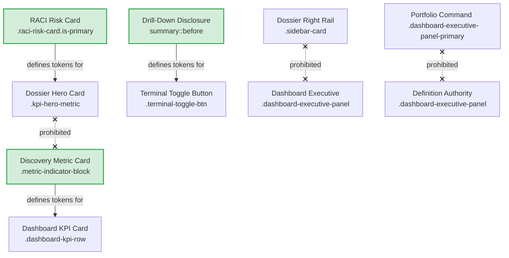

# LEAP Visual Regression Policy & Guardrails

This document establishes the official visual regression policy and guardrails for the LEAP user interface. It serves as a binding governance contract that must be followed by all developers and AI agents before committing modifications to the UI design system.

---

## 1. Golden Visual References

To maintain design stability, the following pages serve as the "Golden Source of Truth" for the visual styles:

* **Dashboard Page**: `index.html` (Golden standard for primary/secondary executive panels, needs-attention list cards, and the execution terminal).
* **Discovery Workspace**: `discovery_report.html` (Golden standard for tabular layouts, tab active/inactive states, progress indicators, and intelligence bands).
* **RACI Directory**: `raci_directory.html` (Golden standard for solid card blocks, primary/warning highlights, and role allocation list layouts).
* **KPI Dossier Page**: `yield_percentage.html` (Golden standard for header hero cards, math formula rendering, tab panel layouts, right-rail inspector cards, and alignment).
* **Search Interface**: `search.html` (Golden standard for form fields, input boxes, typography hierarchy, and search result items).

---

## 2. Component Ownership Matrix

| Component | Canonical Page | Owner | Allowed Inheritance | Forbidden Inheritance |
| :--- | :--- | :--- | :--- | :--- |
| **Dashboard KPI cards** | `index.html` | Dashboard Header | Discovery metric cards | Dashboard executive panels |
| **Portfolio Command** | `index.html` | Primary Dashboard Panel | None (standalone layout) | Metric cards, right rail cards |
| **Definition Authority** | `index.html` | Secondary Dashboard Panel | None | Primary command cards, metric cards |
| **Discovery Intelligence** | `discovery_report.html` | Discovery Workspace | None | Right rail sidebar cards |
| **Discovery Metric Cards** | `discovery_report.html` | Discovery Workspace | Dashboard KPI cards | Dossier header hero cards |
| **RACI Risk Cards** | `raci_directory.html` | RACI Directory | None (canonical source) | Base metric cards |
| **KPI Hero Cards** | `yield_percentage.html` | Dossier Header | Copies tokens from RACI risk cards | Base metric cards, right rail cards |
| **KPI Right Rail** | `yield_percentage.html` | Dossier Inspector | None | Dashboard executive panels |
| **Provenance Grid** | `yield_percentage.html` | Dossier Evidence Tab | None | Lineage formula panels |
| **Disclosure Controls** | `discovery_report.html` | Shared Utilities | Terminal toggle buttons | Toggle perspective selectors |

---

## 3. Change Classification

* **Cosmetic Changes**: Local font weight, color-mix values, text changes, text colors.
* **Component Changes**: Border radius adjustments, inner card padding changes, margin alignments, item spacing.
* **Layout Changes**: Grid column additions, flexbox display updates, flex-wrap properties, sidebar width variations.
* **Architectural Changes**: Global CSS variable shifts, theme structure refactoring, layout grid updates, introduction of new utility framework wrappers.

---

## 4. Mandatory Approval Matrix

| Change Class | Screenshot Comparison Required? | Full Workspace Audit Required? | Visual Sign-Off Required? |
| :--- | :--- | :--- | :--- |
| **Cosmetic** | No | No | No (automated testing only) |
| **Component** | **YES** | No | No |
| **Layout** | **YES** | **YES** | **YES** (requires design lead review) |
| **Architectural** | **YES** | **YES** | **YES** (requires structural architect review) |

---

## 5. Visual Regression Checklist

Before committing any CSS/HTML changes, the following checks must pass:

* [ ] **Dashboard KPI cards**: Verified that card background remains `var(--surface)` (white in light mode) with borders and no shadows.
* [ ] **Portfolio Command**: Verified that no white nested backgrounds are introduced behind the central metric value.
* [ ] **Definition Authority**: Verified that child cards (`.leap-metric-card`) remain transparent with no borders or box shadows.
* [ ] **Discovery Intelligence**: Verified that card groupings align side-by-side in a responsive grid.
* [ ] **Governance Summary**: Verified that progress bars and labels render with consistent margins.
* [ ] **RACI Risk Cards**: Verified that primary cards preserve the solid charcoal background and white text.
* [ ] **KPI Hero Cards**: Verified that height is locked to `72px` and does not push main content down.
* [ ] **KPI Right Rail**: Verified that inspect widgets remain nested in light grey border surrounds.
* [ ] **Provenance Grid**: Verified that keys (`span:first-child`) occupy exactly `220px` width.
* [ ] **Disclosure Controls**: Verified that expand indicator text remains `+` / `−` in monospace font.
* [ ] **Execution Terminal**: Verified that terminal is collapsed (`52px` height) and expands only upon clicking the control button.

---

## 6. Visual Dependency Graph

---

## 7. Rules Prohibited from Being Violated by Future AI Agents

All AI code generators and agents must adhere to the following strict layout constraints:

1. **NO Global Unification Passes**: Do not combine selectors (e.g. `.sidebar-card` and `.raci-risk-card`) into single classes. Each page family must maintain decoupled styling declarations.
2. **NO Implicit Sizing on Block Elements**: Do not declare width modifications on selectors that rely on `display: inline` (e.g., `span`). Elements requiring explicit width parameters must have `display: block` or `display: inline-block` declared first.
3. **NO Hover-based Page Expansion**: Toggles, detail modules, and logs must be controlled by click state only. Disclosures must not expand on mouse hover.
4. **NO Override Blocks without Container Scopes**: All micro-fixes added to CSS must be prefixed with their parent template wrappers (e.g., `.kpi-dossier-workspace` or `.dashboard-executive-panel`) to eliminate side effects on neighboring views.
5. **NO Modification of Baseline Variables**: Do not change design variables (e.g., `var(--surface)`, `var(--charcoal)`) at the root stylesheet level. Modifications must be applied using contextual sub-classes.
